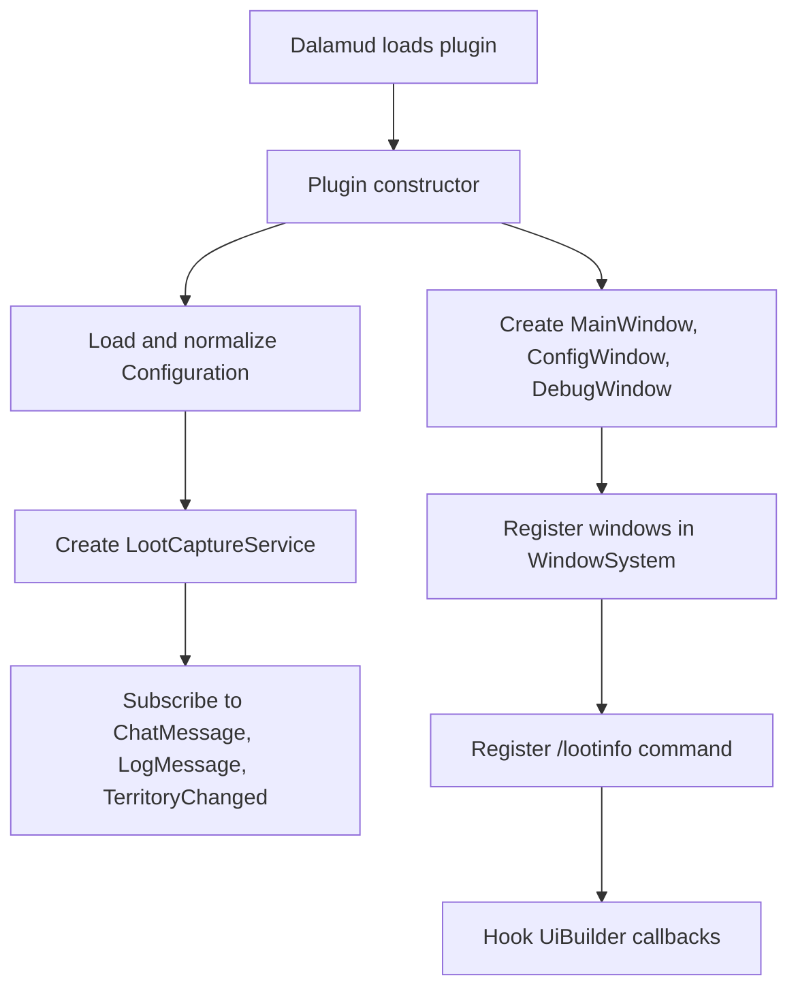
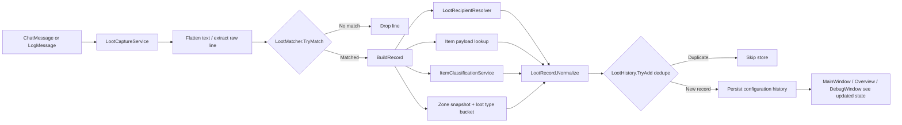
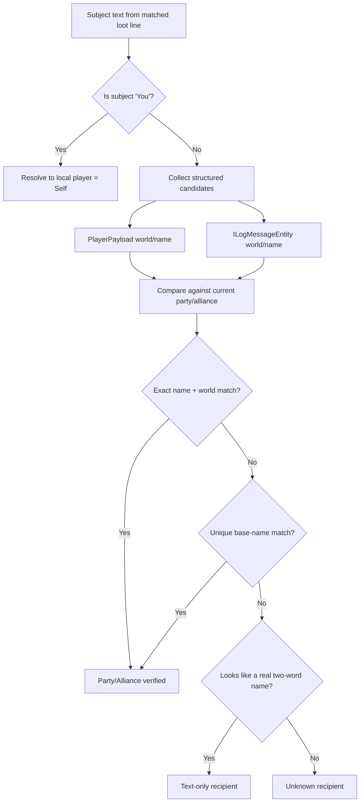
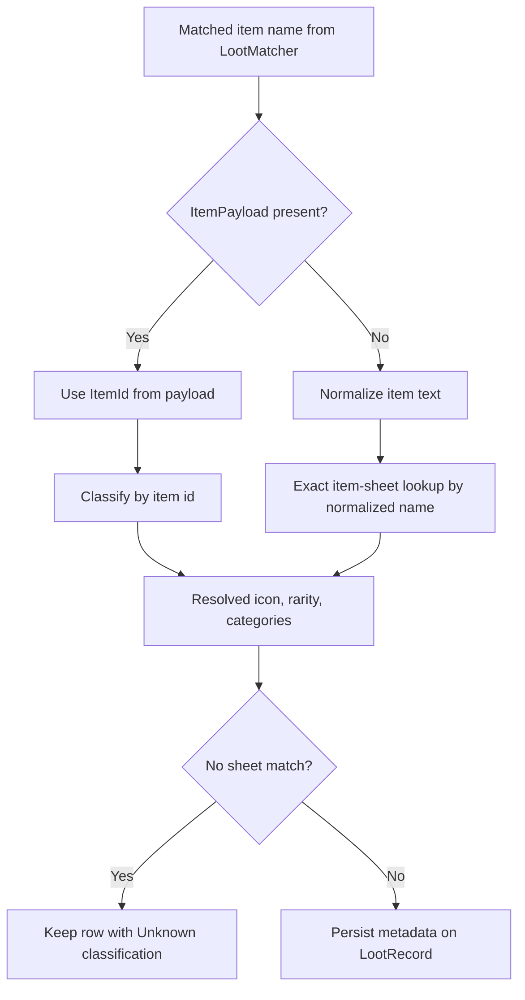
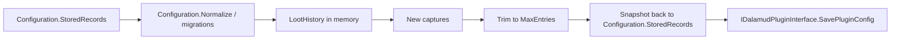
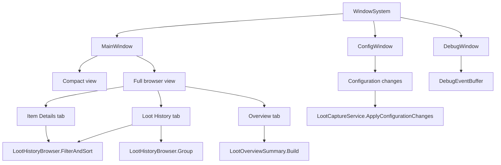
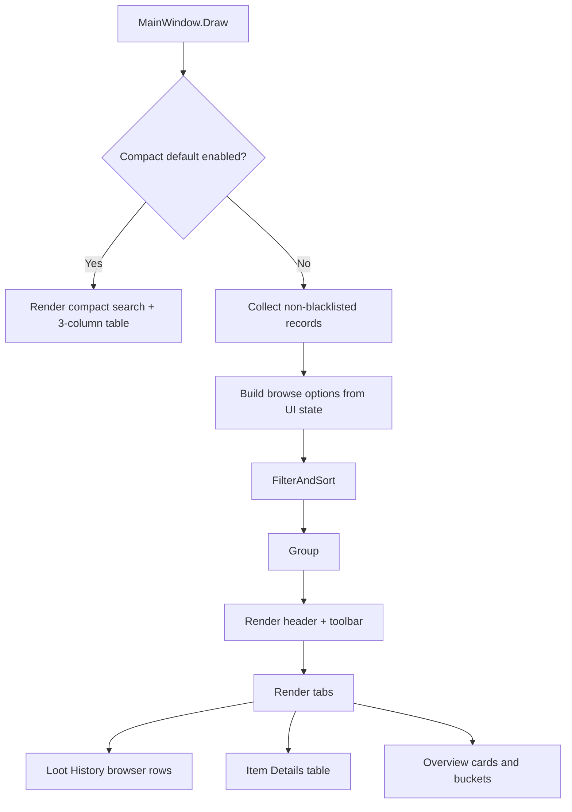

# Loot History Architecture

This document explains how the plugin is structured at runtime and how the main pieces interact. It is intentionally focused on the current implementation rather than aspirational design.

## System Overview

The plugin has four major layers:

1. Dalamud integration and window wiring
2. Capture and enrichment
3. Persistence and in-memory history
4. UI browsing and diagnostics

## Main Components

| Component | Responsibility |
| --- | --- |
| `Plugin` | Creates services and windows, registers commands, hooks Dalamud UI callbacks |
| `LootCaptureService` | Owns chat/log subscriptions, matching, enrichment, dedupe, persistence, and debug events |
| `LootMatcher` | Parses raw loot-like text into a normalized loot payload |
| `LootRecipientResolver` | Resolves `who` from raw subject text plus structured payload/log data and party/alliance state |
| `ItemClassificationService` | Resolves item metadata from item id or normalized item name |
| `LootHistory` | Stores in-memory records and handles dedupe/trim behavior |
| `MainWindow` | Renders compact mode, full history browser, item details, and overview |
| `ConfigWindow` | Persists user preferences, column visibility, favorites defaults, and blacklist management |
| `DebugWindow` | Shows session-only debug events collected by the capture service |

## Runtime Flow

### Plugin Startup

### Capture Pipeline

### Recipient Resolution Strategy

### Item Resolution Strategy

## Persistence Model

The plugin keeps one canonical loot record shape in memory and, when configured, persists a snapshot of that history into the plugin configuration.

Important notes:

- history persistence is immediate after clear/capture/config changes
- debug events are session-only and never written into config
- favorites and blacklist are persisted as item id lists in configuration

## UI Architecture

### Window Responsibilities

### Full Browser Rendering Flow

## Data Shapes

### `LootRecord`

`LootRecord` is the central stored unit. The most important fields are:

- capture timestamp
- zone snapshot
- raw line
- recipient base/display/world fields
- quantity + item name
- loot type bucket
- optional item id/icon/rarity
- classification fields
- who-confidence/group source
- capture source

### `LootHistoryBrowseOptions`

The main browser does not mutate records. Instead it derives a visible slice from:

- search text
- quick filter
- sort mode
- recipient filter
- selected category
- selected zone
- favorite item ids

## Design Boundaries

The current architecture intentionally keeps these boundaries:

- matching and enrichment are offline/local only
- UI browsing never re-derives recipient or item metadata from live game state
- the full main window is richer, but compact mode stays deliberately minimal
- debug tooling is separate from the normal history browser
- no external APIs are required for core functionality

## File Map

Core files to read first:

- `LootDistributionInfo/Plugin.cs`
- `LootDistributionInfo/LootCaptureService.cs`
- `LootDistributionInfo/LootRecipientResolver.cs`
- `LootDistributionInfo/ItemClassificationService.cs`
- `LootDistributionInfo/LootHistoryBrowser.cs`
- `LootDistributionInfo/Windows/MainWindow.cs`
- `LootDistributionInfo/Windows/ConfigWindow.cs`

Supporting behavior:

- `LootDistributionInfo/LootMatcher.cs`
- `LootDistributionInfo/LootQuantityParser.cs`
- `LootDistributionInfo/LootOverviewSummary.cs`
- `LootDistributionInfo/Configuration.cs`
- `LootDistributionInfo/DebugEventBuffer.cs`
